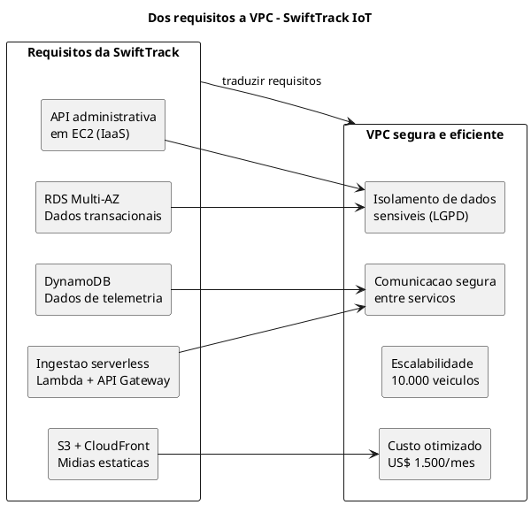
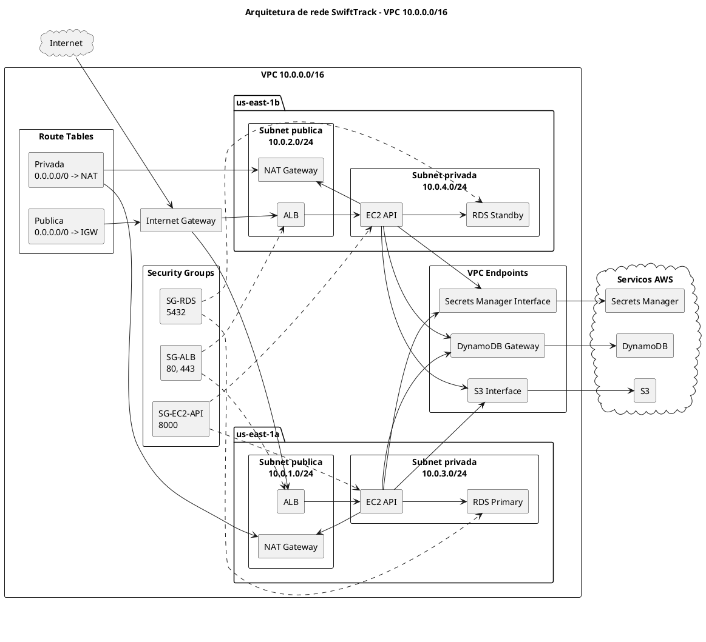
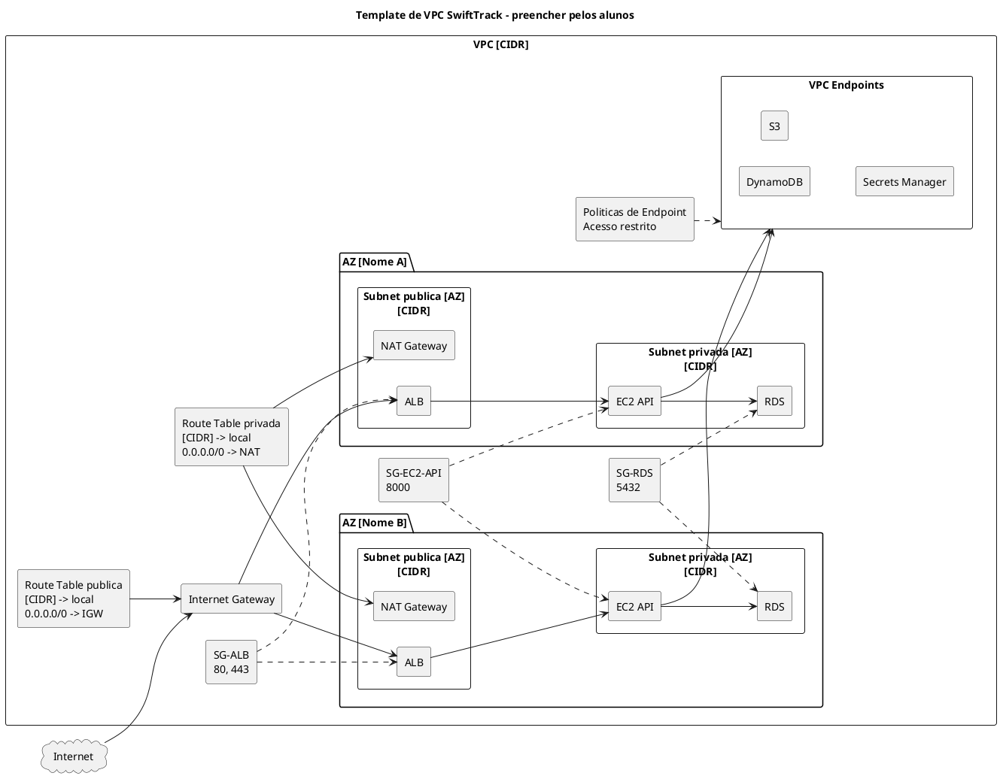

# ROTEIRO DETALHADO - SEMANA 3
### WORKSHOP 1: PROJETO DE VPC E REDE
#### MODELO DE CASOS DE USO ARQUITETURAIS
##### CASE "SWIFTTRACK IOT" COMO EXEMPLO CENTRAL

---

## 1. OBJETIVOS DA SEMANA

### 1.1. Objetivo Geral

Capacitar os alunos a projetar e documentar uma arquitetura de rede na AWS (VPC) para o case SwiftTrack IoT, utilizando a estrutura de Casos de Uso do RUP/UP como ferramenta de modelagem e traduzindo requisitos de segurança e disponibilidade em decisões arquiteturais.

### 1.2. Objetivos Específicos
- Compreender os componentes de uma VPC AWS e suas interações no contexto de uma arquitetura híbrida (serverless + IaaS).
- Modelar casos de uso arquiteturais para infraestrutura de rede da SwiftTrack.
- Projetar uma VPC com sub-redes públicas e privadas distribuídas em múltiplas Zonas de Disponibilidade, considerando a separação entre a API administrativa (EC2) e a ingestão serverless (Lambda).
- Definir tabelas de roteamento, Internet Gateway, NAT Gateway, VPC Endpoints e Security Groups.
- Documentar as decisões de projeto com justificativas técnicas e de custo, alinhadas ao Documento de Visão e Requisitos Suplementares.

---

## 2. ESTRUTURA DA AULA (4 HORAS)

| **Horário** | **Atividade** | **Duração** | **Tipo** |
| :--- | :--- | :--- | :--- |
| 09:00 - 09:15 | Abertura: Conexão com a Semana Anterior | 15 min | Expositiva/Interativa |
| 09:15 - 10:00 | Teoria: VPC AWS e Casos de Uso Arquiteturais | 45 min | Expositiva com Exemplos |
| 10:00 - 10:45 | Estudo de Caso: Arquitetura de Rede para SwiftTrack | 45 min | Análise em Grupo |
| 10:45 - 11:00 | Intervalo | 15 min | - |
| 11:00 - 11:40 | Exercício Prático: Projeto de VPC para SwiftTrack | 40 min | Hands-on em Grupo |
| 11:40 - 12:15 | Preenchimento do Modelo de Casos de Uso | 35 min | Hands-on Guiado |
| 12:15 - 12:45 | Apresentação dos Resultados e Discussão | 30 min | Pitch e Feedback |
| 12:45 - 13:00 | Encerramento, Dúvidas e Orientações para Entrega | 15 min | Sessão Final |

---

## 3. DESENVOLVIMENTO DETALHADO

---

### 3.1. ABERTURA: CONEXÃO COM A SEMANA ANTERIOR (15 min)

**Tema:** "Dos Requisitos à Rede - O Desafio da SwiftTrack"

#### 3.1.1. Revisão Rápida - "O que a SwiftTrack precisa?" (5 min)

**Dinâmica:** Os alunos recebem um **quiz rápido** com perguntas baseadas no Documento de Requisitos Suplementares da SwiftTrack:

| **Pergunta** | **Resposta Correta** |
| :--- | :--- |
| "Qual a disponibilidade exigida para a API de faturamento?" | 99,95% |
| "Qual a latência máxima para ingestão de telemetria?" | 80ms |
| "Qual o RPO exigido para dados do DynamoDB?" | 15 minutos |
| "Qual serviço AWS será usado para a ingestão serverless?" | Lambda + API Gateway |
| "Qual o orçamento mensal máximo?" | US$ 1.500 |

**Objetivo:** Conectar os requisitos não-funcionais às decisões de arquitetura de rede.

#### 3.1.2. Contextualização do Tema - "Por que a VPC é crítica para a SwiftTrack?" (10 min)

**Slide de Abertura:**



**Momento Interativo:**
> *"Observem os serviços AWS da SwiftTrack. Quais vocês acham que devem ficar em sub-redes públicas e quais em sub-redes privadas? Por quê?"*

**Respostas Esperadas:**
- **EC2 (API):** Pode ficar em sub-rede privada, com acesso via Load Balancer público.
- **RDS (PostgreSQL):** Deve ficar em sub-rede privada (dados sensíveis).
- **Lambda:** Não fica em VPC (serverless), mas pode acessar recursos via VPC.
- **S3:** Serviço público, mas com políticas de acesso restritas.

---

### 3.2. TEORIA: VPC AWS E CASOS DE USO ARQUITETURAIS (45 min)

**Tema:** "O que é uma VPC e como modelamos suas decisões?"

#### 3.2.1. Componentes de uma VPC - Aplicados à SwiftTrack (20 min)

| **Componente** | **O que é?** | **Como se aplica à SwiftTrack?** |
| :--- | :--- | :--- |
| **VPC** | Rede virtual privada na AWS, logicamente isolada. | CIDR: 10.0.0.0/16 (espaço para crescimento). |
| **Sub-redes Públicas** | Sub-redes com rota para Internet Gateway. | Para Load Balancer (ALB) que expõe a API. |
| **Sub-redes Privadas** | Sub-redes sem rota direta para Internet. | Para EC2 (API), RDS (banco), instâncias de processamento. |
| **Internet Gateway (IGW)** | Permite comunicação da VPC com a Internet. | Anexado à VPC para acesso público ao ALB. |
| **NAT Gateway** | Permite que instâncias privadas acessem a Internet (atualizações, patches). | Para EC2 em sub-rede privada fazer downloads. |
| **VPC Endpoints** | Conexão privada entre VPC e serviços AWS (sem Internet). | **Critical para SwiftTrack:** DynamoDB, S3 e Secrets Manager acessados sem sair da VPC. |
| **Route Tables** | Tabelas de roteamento que definem o tráfego. | Pública: 0.0.0.0/0 → IGW. Privada: 0.0.0.0/0 → NAT. |
| **Security Groups** | Firewall a nível de instância (regras de entrada/saída). | SG-Web (portas 80, 443), SG-API (porta 8000), SG-DB (porta 5432). |
| **Network ACLs (NACLs)** | Firewall a nível de sub-rede (regras numeradas). | Camada extra de segurança para sub-redes privadas. |

**Slide Ilustrativo - Arquitetura de Rede SwiftTrack:**



#### 3.2.2. Casos de Uso Arquiteturais - O que são e como modelar? (15 min)

**Definição:**
Casos de uso arquiteturais descrevem interações de alto nível entre atores (humanos ou sistemas) e o sistema de infraestrutura. Diferentemente de casos de uso funcionais (foco em funcionalidades de software), os casos de uso arquiteturais focam em **requisitos de infraestrutura, segurança e operações**.

| **Aspecto** | **Caso de Uso Funcional** | **Caso de Uso Arquitetural** |
| :--- | :--- | :--- |
| **Foco** | "O que o sistema faz?" | "Como o sistema é implantado/operado?" |
| **Exemplo (SwiftTrack)** | "Motorista envia dados de GPS" | "Administrador configura VPC para telemetria" |
| **Atores** | Motoristas, Operadores | Administradores de Infraestrutura, DevOps |
| **Artefatos** | Diagrama de Casos de Uso UML | Diagrama de Casos de Uso + Especificações de Infraestrutura |

**Estrutura de um Caso de Uso Arquitetural (SwiftTrack):**

| **Elemento** | **Descrição** | **Exemplo (Configurar VPC SwiftTrack)** |
| :--- | :--- | :--- |
| **Identificador** | ID único do caso de uso. | UC-ARQ-001 |
| **Nome** | Nome descritivo. | Configurar VPC e Rede para SwiftTrack. |
| **Ator(es)** | Quem interage com o sistema. | Administrador de Infraestrutura. |
| **Pré-condição** | O que deve estar disponível. | Conta AWS ativa, permissões IAM. |
| **Pós-condição** | Estado após a execução. | VPC criada, sub-redes configuradas, endpoints configurados. |
| **Fluxo Principal** | Passos normais. | 1. Criar VPC. 2. Criar sub-redes. 3. Configurar endpoints. |
| **Fluxos Alternativos** | Exceções e variações. | Falha na criação da VPC, falta de permissões. |
| **Requisitos Não-Funcionais** | Métricas de sucesso. | VPC criada em < 5 min, isolamento de dados sensíveis. |
| **Riscos** | O que pode dar errado. | Endereçamento IP conflitante, VPC Endpoint mal configurado. |

#### 3.2.3. Casos de Uso Arquiteturais da SwiftTrack (10 min)

| **Caso de Uso** | **Descrição** | **Serviços AWS Envolvidos** |
| :--- | :--- | :--- |
| **UC-ARQ-001** | Configurar VPC e Rede | VPC, Sub-redes, IGW, NAT, Route Tables |
| **UC-ARQ-002** | Configurar Segurança de Rede | Security Groups, NACLs, IAM |
| **UC-ARQ-003** | Configurar VPC Endpoints | DynamoDB, S3, Secrets Manager endpoints |
| **UC-ARQ-004** | Configurar Conectividade entre Camadas | ALB, EC2, RDS, Lambda (VPC) |

**Exemplo Completo - UC-ARQ-003 (VPC Endpoints):**

| **Elemento** | **Especificação** |
| :--- | :--- |
| **Identificador** | UC-ARQ-003 |
| **Nome** | Configurar VPC Endpoints para Serviços AWS |
| **Ator Principal** | Administrador de Infraestrutura |
| **Ator Secundário** | Sistema AWS (DynamoDB, S3, Secrets Manager) |
| **Pré-condição** | VPC criada, sub-redes privadas configuradas. |
| **Pós-condição** | EC2 e Lambda podem acessar DynamoDB, S3 e Secrets Manager via rede privada. |

| **Fluxo Principal** | **Descrição** |
| :--- | :--- |
| **Passo 1** | Administrador identifica os serviços AWS que precisam ser acessados pela VPC. |
| **Passo 2** | Cria VPC Endpoint para DynamoDB (Gateway Endpoint). |
| **Passo 3** | Cria VPC Endpoints para S3 e Secrets Manager (Interface Endpoints). |
| **Passo 4** | Associa endpoints às sub-redes privadas. |
| **Passo 5** | Atualiza políticas de endpoint para restringir acesso. |
| **Passo 6** | Valida conectividade: EC2 → DynamoDB, Lambda → S3. |

| **Fluxos Alternativos** | **Descrição** |
| :--- | :--- |
| **Alt 1** | Serviço não suporta Gateway Endpoint (ex: Secrets Manager) → usar Interface Endpoint. |
| **Alt 2** | Política de endpoint bloqueia acesso → revisar e ajustar. |

| **Requisitos Não-Funcionais** | **Métrica** |
| :--- | :--- |
| **Segurança** | Tráfego não sai da VPC. |
| **Custo** | Interface Endpoints: $0.01/hora cada. |
| **Desempenho** | Latência reduzida vs acesso via Internet. |

| **Riscos** | **Mitigação** |
| :--- | :--- |
| **Custo elevado** | Usar Gateway Endpoint para serviços suportados (DynamoDB, S3). |
| **Políticas restritivas** | Testar políticas com usuários específicos antes de aplicar. |

---

### 3.3. ESTUDO DE CASO: ARQUITETURA DE REDE PARA SWIFTTRACK (45 min)

**Tema:** "Como a SwiftTrack organizaria sua rede?"

#### 3.3.1. Apresentação do Cenário - "O Desafio da SwiftTrack" (10 min)

**Cenário:**
> *A SwiftTrack precisa projetar sua VPC para suportar:*
> - **API administrativa:** Django REST Framework em EC2, acessada por operadores via internet.
> - **Ingestão de telemetria:** Lambda + API Gateway (serverless), que escreve em DynamoDB.
> - **Banco de dados relacional:** RDS PostgreSQL em Multi-AZ, acessado apenas pela API.
> - **Armazenamento de arquivos:** S3 para comprovantes, integrado com CloudFront.
> - **Segredos:** Secrets Manager para credenciais do banco.

**Pergunta para a Turma:**
> *"Como vocês organizariam essa arquitetura em termos de sub-redes e segurança?"*

#### 3.3.2. Atividade em Grupo - "Projetando a VPC da SwiftTrack" (25 min)

**Template Entregue aos Alunos:**

| **Componente** | **Decisão de Projeto** | **Justificativa Técnica** | **Justificativa de Custo** |
| :--- | :--- | :--- | :--- |
| **VPC CIDR** | | | |
| **Número de AZs** | | | |
| **Sub-redes Públicas** | | | |
| **Sub-redes Privadas** | | | |
| **NAT Gateway** | | | |
| **VPC Endpoints** | | | |
| **Security Groups** | | | |
| **NACLs** | | | |

**Instruções:**
1. Cada grupo recebe o Documento de Visão e Requisitos Suplementares da SwiftTrack.
2. Com base nos requisitos, projetam a VPC e preenchem o template.
3. Devem justificar **cada decisão** com base em requisitos técnicos e de custo.

**Exemplo de Preenchimento:**

| **Componente** | **Decisão** | **Justificativa Técnica** | **Justificativa de Custo** |
| :--- | :--- | :--- | :--- |
| **VPC CIDR** | 10.0.0.0/16 | Espaço para 65.536 IPs, suficiente para crescimento. | $0 |
| **Número de AZs** | 2 AZs (us-east-1a, us-east-1b) | RDS Multi-AZ exige 2 AZs para failover. | $0 (AZs são gratuitas) |
| **Sub-redes Públicas** | 2 sub-redes (10.0.1.0/24, 10.0.2.0/24) | Para ALB e NAT Gateway. | $0 |
| **Sub-redes Privadas** | 2 sub-redes (10.0.3.0/24, 10.0.4.0/24) | Para EC2 (API) e RDS (banco). | $0 |
| **NAT Gateway** | 1 NAT Gateway por AZ (2 total) | EC2 em sub-rede privada precisa atualizar pacotes. | ~$0.045/hora cada (~$64/mês) |
| **VPC Endpoints** | DynamoDB (Gateway), S3 (Interface), Secrets Manager (Interface) | Evita tráfego via Internet; mais seguro e barato. | Interface: $0.01/hora cada (~$14/mês) |
| **Security Groups** | SG-ALB (80,443), SG-EC2 (8000), SG-RDS (5432) | Isolamento por camada: ALB → EC2 → RDS. | $0 |

#### 3.3.3. Discussão e Comparação de Decisões (10 min)

**Perguntas para Estimular Debate:**

1. *"Alguém escolheu 3 AZs? Por quê?"*
2. *"Alguém optou por NAT Instance em vez de NAT Gateway? Por quê?"*
3. *"VPC Endpoints valem o custo adicional?"*
4. *"O que vocês fariam para reduzir o custo da VPC?"*

**Trade-offs Identificados:**

| **Decisão** | **Prós** | **Contras** | **Custo Impacto** |
| :--- | :--- | :--- | :--- |
| **NAT Gateway** | Gerenciado, alta disponibilidade, escalável. | Mais caro que NAT Instance. | $64/mês (2 AZs) |
| **NAT Instance** | Mais barato (~$10/mês). | Precisa gerenciar, failover manual. | $10/mês |
| **VPC Endpoints** | Mais seguro, menor latência. | Custo adicional (~$14/mês). | $14/mês |
| **Sem Endpoints** | Sem custo adicional. | Tráfego via Internet, menos seguro. | $0 |

**Conclusão:** Para a SwiftTrack, o custo adicional de NAT Gateway e VPC Endpoints é justificado pela **segurança (LGPD)** e **disponibilidade (99,95%)**.

---

### 3.4. EXERCÍCIO PRÁTICO: PROJETO DE VPC PARA SWIFTTRACK (40 min)

**Tema:** "Mãos à Obra - Diagrama e Casos de Uso"

#### 3.4.1. Instruções e Template (5 min)

**Instruções:**
1. Baseado no Documento de Visão e Requisitos Suplementares da SwiftTrack, cada grupo projeta a VPC.
2. Deve incluir:
   - **Diagrama de VPC** (Draw.io/Lucidchart) com todos os componentes.
   - **3 Casos de Uso Arquiteturais** (UC-ARQ-001, UC-ARQ-002, UC-ARQ-003).
   - **Justificativas detalhadas** para cada decisão.

**Template do Diagrama de VPC (Entregue aos Alunos):**



#### 3.4.2. Atividade em Grupo - Criação do Projeto (25 min)

**Passo 1: Definição da VPC (5 min)**

| **Decisão** | **SwiftTrack** | **Justificativa** |
| :--- | :--- | :--- |
| **VPC CIDR** | 10.0.0.0/16 | Espaço para crescimento. |
| **Número de AZs** | 2 (us-east-1a, us-east-1b) | RDS Multi-AZ exige 2 AZs. |
| **Sub-redes Públicas** | 10.0.1.0/24, 10.0.2.0/24 | Para ALB e NAT Gateway. |
| **Sub-redes Privadas** | 10.0.3.0/24, 10.0.4.0/24 | Para EC2 (API) e RDS. |
| **NAT Gateway** | 1 por AZ (2 total) | EC2 precisa de acesso à Internet para atualizações. |
| **VPC Endpoints** | DynamoDB, S3, Secrets Manager | Segurança e custo otimizado. |

**Passo 2: Definição de Security Groups (5 min)**

| **Security Group** | **Regras de Entrada** | **Regras de Saída** | **Justificativa** |
| :--- | :--- | :--- | :--- |
| **SG-ALB** | 0.0.0.0/0 (80, 443) | 0.0.0.0/0 (80, 443) | Acesso público via HTTP/HTTPS. |
| **SG-EC2-API** | SG-ALB (8000) | SG-RDS (5432), DynamoDB, S3 | Apenas ALB acessa a API; API acessa banco e serviços. |
| **SG-RDS** | SG-EC2-API (5432) | - | Apenas API acessa banco. |

**Passo 3: Definição de Endpoints (5 min)**

| **Serviço** | **Tipo de Endpoint** | **Justificativa** |
| :--- | :--- | :--- |
| **DynamoDB** | Gateway Endpoint | Não cobra por hora, mais barato. |
| **S3** | Interface Endpoint | Interface endpoint para acesso privado. |
| **Secrets Manager** | Interface Endpoint | Não suporta Gateway Endpoint. |

**Passo 4: Definição de Casos de Uso (10 min)**

**UC-ARQ-001 - Configurar VPC e Rede SwiftTrack**

| **Elemento** | **Especificação** |
| :--- | :--- |
| **Identificador** | UC-ARQ-001 |
| **Nome** | Configurar VPC e Rede SwiftTrack |
| **Ator Principal** | Administrador de Infraestrutura |
| **Pré-condição** | Conta AWS ativa, permissões IAM. |
| **Pós-condição** | VPC com CIDR 10.0.0.0/16, 4 sub-redes (2 públicas, 2 privadas - Multi-AZ), IGW, NAT Gateways, endpoints configurados. |

| **Fluxo Principal** | **Descrição** |
| :--- | :--- |
| **Passo 1** | Administrador acessa o Console AWS. |
| **Passo 2** | Cria VPC com CIDR 10.0.0.0/16 e habilita DNS hostnames. |
| **Passo 3** | Cria 2 sub-redes públicas (uma por AZ) com CIDR 10.0.1.0/24, 10.0.2.0/24. |
| **Passo 4** | Cria 2 sub-redes privadas (uma por AZ) com CIDR 10.0.3.0/24, 10.0.4.0/24. |
| **Passo 5** | Cria e anexa Internet Gateway à VPC. |
| **Passo 6** | Cria NAT Gateways (um por AZ) nas sub-redes públicas. |
| **Passo 7** | Configura Route Table pública: 10.0.0.0/16 → local, 0.0.0.0/0 → IGW. |
| **Passo 8** | Configura Route Table privada: 10.0.0.0/16 → local, 0.0.0.0/0 → NAT Gateway. |
| **Passo 9** | Cria VPC Endpoints para DynamoDB (Gateway), S3 e Secrets Manager (Interface). |
| **Passo 10** | Associa sub-redes públicas à Route Table pública e privadas à Route Table privada. |
| **Passo 11** | Valida conectividade: ALB → EC2 → RDS, EC2 → DynamoDB via endpoint. |

| **Requisitos Não-Funcionais** | **Métrica** |
| :--- | :--- |
| **Disponibilidade** | Multi-AZ com 2 AZs (redundância). |
| **Segurança** | Sub-redes privadas sem rota direta para Internet. |
| **Custo** | NAT Gateway: ~$64/mês; VPC Endpoints: ~$14/mês. |

| **Riscos** | **Mitigação** |
| :--- | :--- |
| **Custo elevado do NAT Gateway** | Avaliar uso de NAT Instance (mais barato, menos gerenciado). |
| **Erro de roteamento** | Testar conectividade com `ping` ou `traceroute` após configuração. |

---

### 3.5. PREENCHIMENTO DO MODELO DE CASOS DE USO (35 min)

**Tema:** "Documentando Decisões Arquiteturais"

#### 3.5.1. Template do Modelo de Casos de Uso (5 min)

**Template Entregue aos Alunos:**

```
| **Elemento** | **Especificação** |
| :--- | :--- |
| **Identificador** | UC-ARQ-[NNN] |
| **Nome** | [Nome do Caso de Uso] |
| **Versão** | 1.0 |
| **Data** | [DD/MM/AAAA] |
| **Status** | [Draft / Revisado / Aprovado] |

| **Ator Principal** | [Quem executa a ação principal?] |
| **Ator Secundário** | [Sistemas ou pessoas que auxiliam?] |

| **Pré-condição** | 1. [Condição 1] 2. [Condição 2] |
| **Pós-condição** | 1. [Estado final 1] 2. [Estado final 2] |

| **Fluxo Principal** | **Passos** |
| :--- | :--- |
| 1. | [Descrição do passo 1] |
| 2. | [Descrição do passo 2] |
| ... | ... |
| N. | [Descrição do passo N] |

| **Fluxos Alternativos** | **Descrição** |
| :--- | :--- |
| Alt 1 | [Exceção 1] |
| Alt 2 | [Exceção 2] |
| ... | ... |

| **Requisitos Não-Funcionais** | **Métrica** |
| :--- | :--- |
| Desempenho | [Tempo, throughput, etc.] |
| Disponibilidade | [SLA, RPO, RTO] |
| Segurança | [Requisitos de segurança] |
| Custo | [Estimativa de custo] |

| **Riscos** | **Mitigação** |
| :--- | :--- |
| [Risco 1] | [Mitigação 1] |
| [Risco 2] | [Mitigação 2] |
| ... | ... |

| **Referências** | 1. [AWS VPC Documentation] 2. [AWS Well-Architected] |
```

#### 3.5.2. Preenchimento Guiado - UC-ARQ-002 (Segurança de Rede) (10 min)

**UC-ARQ-002 - Configurar Segurança de Rede SwiftTrack**

| **Elemento** | **Especificação** |
| :--- | :--- |
| **Identificador** | UC-ARQ-002 |
| **Nome** | Configurar Segurança de Rede para